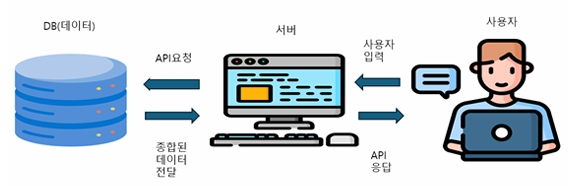

# 🏋️서울시 피트니스 네트워크 웹사이트 프로젝트 계획서🏃‍♂️
이 프로젝트는 서울 지역의 운동 프로그램 정보를 제공하는 웹사이트 개발하는 프로젝트입니다.  
> 👤 202004219 윤주성, 202284049 박병관

## 1. 프로젝트 개요
- **개발 배경**: 최근에 운동에 관심이 많아져서 집 주변에서 운동을 계획 하려고 하였으나 
                 마땅히 운동에 관한 정도를 얻을 수 없어서 기획하게됨
- **목표**: 꾸준한 운동 및 운동 프로그램을 최종적으로 서울 시민들의 고혈압, 당뇨병, 
            고지혈증, 비만 등 질병을 줄이도록 서울 시민들의 참여를 유도하는 것이 목표
- **주요 기능**:
  - 피트니스 센터 검색 및 필터링
  - 챗봇을 통한 고객 지원

## 2. 주요 일정
| 단계         | 기간          | 내용                         |
| ------------ | ------------- | ---------------------------- |
| 프로젝트 계획 | 1 ~ 3주차  | 프로젝트 계획 수립 및 수정|
| 설계          | 4 ~ 7주차 | 데이터 전처리 및 챗봇 웹사이트 틀 만들기|
| 개발          | 8 ~ 13주차 | 챗봇 웹사이트 생성|
| 배포          | 14 ~ 15주차 | 웹사이트 배포 및 운영 시작 |

## 3. 시스템 구조

1. 사용자는 웹 인터페이스를 통해 지도를 보고, 구를 클릭하거나 운동 관련 필터를 선택합니다. 
2. 서버는 사용자 요청을 바탕으로 DB에 있는 관련 데이터를 요청합니다. 
3. DB는 운동 종류, 시간대 등의 데이터를 저장하고 있으며, 서버로 요청한 데이터를 전달합니다. 
4. 서버는 DB에서 받은 데이터를 사용자에게 보여줄 수 있도록 다시 응답합니다.

## 4. 팀원 역할분담
- **윤주성**: UI 구성 및 코드 작성
- **박병관**: 코드 작성 및 구조 설계

## 5. 기능 설명
- **검색 기능**: 사용자가 지역, 가격대, 운동 종목으로 피트니스 센터를 검색할 수 있습니다.
- **트레이너 예약**: 트레이너와 시간대를 선택해 예약할 수 있는 기능을 제공합니다.
- **챗봇 기능**: 사용자가 질문을 하면, 자동 응답 시스템을 통해 정보를 제공합니다.

## 6. 기대효과 및 활용 분야
- 서울시 피트니스 네트워크를 통해 서울 시민의 자발적인 운동 참여를 
  유도하고 최종적으로는 한국 전체의 질병을 예방할 수 있는 프로젝트를 계획 할 예정입니다.

---
